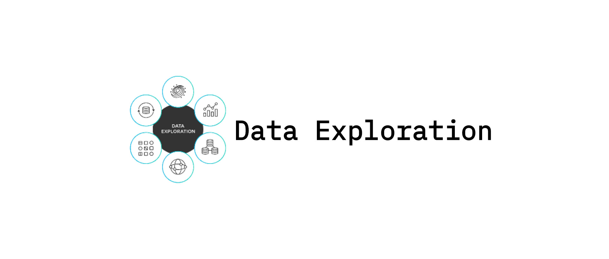

  
 
   


<h1 align="center">Data Exploration</h1>



[Reference...](#documentation-reference)

**Data exploration** is the initial step in data analysis, where users explore a large 
data set in an unstructured way to uncover initial patterns, characteristics, and 
points of interest. This process is not meant to reveal every bit of information a dataset holds, but rather to help create a broad picture of important
trends and major points to study in greater detail. Data exploration can use a combination of manual methods and automated tools such as _data visualizations_, _charts_, and _initial reports_. Most data analytics software includes
visualization tools and charting features that make
exploration at the outset significantly easier, helping reduce data by rooting out information that is not required, or which can distort results in the long run. **Data exploration** can also assist by reducing work time and finding more useful and actionable insights from the start alongside presenting clear paths to perform better analysis. 

###  Installation

> Install data exploration with pip.

CLI:
```bash
   pip install data-exploration-analysis
```

```bash
   pip install https://github.com/christiangarcia0311/data-exploration-analysis/raw/main/dist/data_exploration_analysis-3.1.2.tar.gz
```


## Univariate Analysis

Univariate analysis explores variables (attributes) one by one. Variables could 
be either categorical or numerical. There are different statistical and visualization techniques of investigation for each type of variable. Numerical
variables can be transformed into categorical counterparts by a process called binning or discretization. It is also possible to transform a categorical variable into its numerical counterpart by a process called encoding. Finally, proper handling of missing values is an important issue in mining data.


**Univariate:**

```python

    # import univariate class
    from DataExploration.analysis import Univariate
  
    # create new univariate object
    univariate = Univariate()
```

### BINNING 

> **Binning**, also known as discretization a data preprocessing technique used to convert continuous data into discrete bins or intervals. This process involves dividing a continuous range of values into a finite number of intervals or bins and then assigning each value to a corresponding bin. There are two types of binning, unsupervised and supervised

##  UNSUPERVISED BINNING

**Unsupervised binning** methods transform numerical variables into categorical counterparts but do not use the
target (class) information. Equal Width and Equal Frequency are two unsupervised binning methods.

### Equal Width Binning

> The algorithm divides the data into k intervals of equal size.


**Sample/Usage:**
```python
    
    """
        Perform Equal Width Binning
     
        Parameters:
        - data (DataFrame): containing the relevant columns.
        - feature-column (str): selected column to be bin.
        - bins (int): specify the number of bins to be use.
     
        Returns:
        - List: containing equal width binning results
        - String: containing the label and binning results
        - Plot: visualize the binned data
        
    """
```

**Code:**

```python

    # perform equal width binning using this method
    equal_width = univariate.equal_width(data['feature-column'], bins=10)
  
    # show split bins
    univariate.ewidth_bin(data['feature-column'], bins=10)
  
    # plot equal width binning
    univariate.ewidth_plot(equal_width)
  

```

### Equal Frequency Binning

> The algorithm divides the data into k groups which each group contains 
approximately same number of values.


**Sample/Usage:**

```python
    
    """
       Perform Equal Frequency Binning
       
       Parameters:
       - data (DataFrame): containing the relevant columns.
       - feature-column (str): column name to be bin.
       - bins (int):  specify the number of bins to be use.
       
       Returns:
       - List: containing equal width binning results
       - String: containing the label and binning results
       - Plot: visualize the binned data
       
    """

```
**Code:**

```python


    # perform equal frequency binning using this method
    equal_freq = univariate.equal_freq(data['feature-column'], bins=10)
  
    # show split bins 
    univariate.efreq_bin(data['feature-column'], bins=10)
  
    # plot equal frequency binning
    univariate.efreq_plot(equal_freq)
  
```

## SUPERVISED BINNING

**Supervised binning** methods transform numerical variables into categorical counterparts and refer to the
target (class) information when selecting discretization cut points.

### Entropy-Based Binning

> This method uses a split approach. The **entropy** _(or the information content)_ is calculated based on the class label. Intuitively, it finds the best split so that the bins are as pure as possible that is the majority of the values in a bin correspond to have the same class label. 

**Sample/Usage:**
```python

    """
    Perform Entropy Based Binning
    
    Parameters:
    - data (DataFrame): containing the relevant columns.
    - feature-column (str): column name to be bin.
    - target-column (str): slected column for calculating the entropy
    
    Returns:
    - DataFrame: containing entropy data information.
    - String:  contains data information in split interval.
    
    """

```

**Code:**

```python
   
    # calculate entropy of bins using this method
    entropy = univariate.entropy_bin(data, 'feature-column', 'target-column')
   
    # your-file.ipynb
    > entropy
    
    # your-file.py
    > print(entropy)
   
    # split bins informatiom gain interval
    univariate.split_bins(data, 'feature-column', 'target-column')
   
   
```

## ENCODING

>  **Encoding** or _continuization_ refers to the process of transforming categorical or qualitative data into numerical format, often necessary for statistical analysis or machine learning algorithms that require numerical inputs.

### Binary Encoding

> Numerization of categorical variables by taking the values 0 or 1 to indicate the 
absence or presence of each category.

**Sample/Usage:**

```python
    """
    Create Binary Encoding
    
    Parameters:
    - data (DataFrame): the dataset contains relevant column being used.
    - selected-column (str): column name needs to be encoded.
    - encode-column (str): column contains binary encoded values.
    
    Returns:
    - DataFrame: containing the data encoded information.
    """
    
```

**Code:**

```python
   
    # create binary encoding using this method
    binary_en = univariate.binary_encoding(data, data['selected-column'], 'encode-column')
   
    # your-file.ipynb
    > binary_en
   
    # your-file.py
    > print(binary_en)
   
   
```

### Target-Based Encoding

> Target-based encoding is numerization of categorical variables via target.

**Sample/Usage:**
```python
    """
    Create Target-Based Encoding
    
    Parameters:
    - data (DataFrame): dataset containing relevant columns being used.
    - feature-column (str): selected column to be encode.
    - target-column (str): target column values for computing means.
    
    Returns:
    - DataFrame: containing the data encoded and probability information
    """
    
```

**Code:**

```python

   
    # create target encoding using this method
    target_en = univariate.target_encoding(data, data['feature-column'], 'target-column')
   
    # your-file.ipynb
    > target_en
   
    # your-file.py
    > print(target_en)
   
   
```

### Missing Values

> Missing values are a common occurrence, and you need to have a strategy for treating them. A missing value can signify a number of different things in your data. Perhaps the data was not available or not applicable or the event did not happen. It could be that the person who entered the data did not know the right value or missed filling in. 

**Sample/Usage:**

```python
    """
    Perform Impute Values
    
    Parameters:
    - data (DataFrame): containing relevant columns with missing values.
    
    Returns:
    - DataFrame: contains impute values.
    """
```

**Code:**

```python

    # impute data with missing values
    impute = univariate.impute_values(data)
   
    # your-file.ipynb
    > impute
   
    # your-file.py
    > print(impute)
   
```

## CATEGORICAL VALUES

| Statistics | Description |
|-----------|--------|
| `Count` | The number of values (observations) of the variable. |

#### Sample/Usage:

```python
    
    """
    Count Values in Column
    
    Parameters:
    - data (DataFrame): dataset to be used for counting.
    - feature-column (str): column name to perform count.
    
    Returns:
    - DataFrame: containing count in numerical and decimal format.
    
    """

    # count values using this method
    count_instance  = univariate.count(data, 'feature-column')
   
    # your-file.ipynb
    > count_instance
   
    # your-file.py
    > print(count_instance)
   
```

> **Pie Chart:** A pie chart is a circular statistical graphic
divided into slices to illustrate the proportional distribution
of categorical values within a dataset. Each slice
represents a category's relative frequency or percentage.

_Sample/Usage:_

```python
     
     """
     Create Pie Chart
     
     Parameters:
     - data (DataFrame): dataset containing relevant columns.
     - feature-column (str): column name to be displayed in chart.
     
     Returns:
     - Plot: containing the distribution of categorical values.
       
     """
    
    # create pie chart using this method
    univariate.piechart(data, 'feature-column')
   
```

> **Bar Chart:** A bar chart for categorical values displays
the frequency or count of each category using bars of
equal width.

_Sample/Usage:_

```python
    
    """
    Create Bar Chart
    
    Parameters:
    - data (DataFrame): dataset containing relevant columns.
    - feature-column (str): column name to be displayed in chart.
     
    Returns:
    - Plot: containing the frequency of each category.
       
     """

    # create bar chart using this method
    univariate.barchart(data, 'feature-column')
   
```

## NUMERICAL VALUES

> **Central Tendency:**

| Statistics | Description |
|-----------|--------|
| `Min` | The smallest value of the variable. |
| `Max` | The largest value of the variable.|
| `Mean` | The sum of the values divided by the count. |
| `Median` | The middle value. Below and above median lies an equal number of values. |
| `Mode` | The most frequent value. There can be more than one mode. |

#### Sample/Usage:

```python

    # Determine min, max, mean, median and mode
    central_tendency = univariate.central_tendency(data)
   
    # your-file.ipynb
    > central_tendency
   
    # your-file.py
    > print(central_tendency)
   
```

> **Dispersion Variability:**

| Statistics | Description |
|-----------|--------|
| `Range`   | The difference between maximum and minimum.|
| `Quantiles`   | A set of 'cut points' that divide a set of data into groups containing equal numbers of values (Quartile, Quintile, Percentile, ...). |
| `Variance` | A measure of data dispersion. |
| `Standard Deviation` | The square root of variance. |
| `Coefficient of Variance` | A measure of data dispersion divided by mean. |

#### Sample/Usage:

```python

    # Determine range, quantiles, variance, standard deviation and coefficient of variation
    dispersion = univariate.dispersion_variability(data)
   
    # your-file.ipynb
    > dispersion
   
    # your-file.py
    > print(dispersion)
   
```

> **Distribution Shape:**

| Statistics | Description |
|-----------|--------|
| `Skewness` | A measure of symmetry or asymmetry in the distribution of data. |
| `Kurtosis` | A measure of whether the data are peaked or flat relative to a normal distribution. |

#### Sample/Usage:

```python
    
    # Determine skewness and kurtosis
    distribution = univariate.distribution_shape(data)
   
    # your-file.ipynb
    > distribution
   
    # your-file.py
    > print(distribution)
   
```

> **Histogram:** A histogram is a graphical representation that displays the distribution of a single numeric variable by
showing the frequency of data points within specified
ranges (bins).

#### Sample/Usage:

```python
    
    """
    Create Histogram
    
    Parameters:
    - data (DataFrame): dataset being used.
    - bins (int): specify number of bins to be used.
    
    Returns:
    - Plot: containing the category information.
    
    """
    
    # create a histogram of numerical values using this method
    univariate.histogram(data, bins=10)
   
```

> **Box Plot:** A boxplot in univariate analysis is a
graphical representation that summarizes the distribution
of a numerical dataset by showing its median, quartiles
and potential outliers.

#### Sample/Usage:

```python
    
    # create a boxplot using this method
    univariate.boxplot(data)
   
```

## Bivariate Analysis

Bivariate analysis is the simultaneous analysis of two
variables (attributes). It explores the concept of
relationship between two variables, whether there exists an association and the strength of this association or whether
there are differences between two variables and the
significance of these differences. There are three types of
bivariate analysis.

**Bivariate:**

```python
   
    # import bivariate class
    from DataExploration.analysis import Bivariate
  
    # create new bivariate object
    bivariate = Bivariate()
  
```

## NUMERICAL & NUMERICAL VALUES

### Scatter Plot

> A **scatter plot** is a useful visual representation of the
relationship between two numerical variables (attributes) and is usually drawn before working out a linear correlation or fitting a regression line. The resulting pattern indicates the type (linear or non-linear) and strength of the
relationship between two variables.

#### Sample/Usage:

```python
    
    """
    Create Scatter Plot
    
    Parameters:
    - data (DataFrame): contains relevant columns to be used.
    - X_data_column (str): columns assigned in X-Axis.
    - Y_data_column (str): columns assigned in Y-Axis.
    
    Returns:
    - Plot: containing the relationship information of data.
    
    """
    
```

**Code:**

```python
    
    # create a scatterplot using this method
    bivariate.scatterplot(data, 'X_data_column', 'Y_data_column')
   
```

### Linear Correlation

> **Linear correlation** quantifies the strength of a linear relationship between two numerical variables. When there is no correlation between two variables, there is no tendency for the values of one quantity to increase or
decrease with the values of the second quantity.

#### Sample/Usage:

```python
    
    """
    Create Linear Correlation
    
    Parameters:
    - data (DataFrame): contains relevant columns to be used.
    - X_data_column (str): columns assigned in X-Axis.
    - Y_data_column (str): columns assigned in Y-Axis.
    
    Returns:
    - Plot: containing the strength of a linear relationship information of data.
    
    """
    
```

**Code:**

```python
    
    # create a linear correlation using this method
    bivariate.correlation(data, X_data_column', 'Y_data_column')
    
```
## CATEGORICAL & CATEGORICAL VALUES

### Chi-Squared Test

> **Chi-squared test** helps to determine whether there is a relationship between the variables or if any observed association is due to chance.

#### Sample/Usage:

```python
    """
    Perform Chi-Squared Test
    
    Parameters:
    - data (DataFrame): contains relevant columns to be used.
    - first_column (str): first column assigned for the contingency table.
    - second_column (str): second column assigned for the contingency table.
    
    Returns:
    - DataFrame: containing the information of the  category.
    
    """
    
```

**Code:**

```python
    
    # convert your dataset into contingency table
    dataset = bivariate.contingency_table(data, 'first-column', 'second-column')
    
    # perform chi-squared test using this method
    # assigned parameter to the converted data
    chi_squared, expected_freq = bivariate.chisquared(dataset)
    
    # your-file.ipynb
    > chi_squared
    > expected_freq
    
    # your-file.py
    > print(chi_squared)
    > print(expected_freq)

```

> **Bar Chart:** this visualization helps in understanding the relationship between two categorical variables by comparing their distributions. It can reveal patterns, trends or associations between the variables.

#### Sample/Usage:

```python
    
    """
    Parameters:
    - data (DataFrame): contains relevant columns to be used.
    - first_column (str): column used for categories (X-Axis).
    - second_column (str): column used for values (Y-Axis).
    
    Returns:
    - Plot: containing the patterns and categories of the data.
    
    """
    
```

**Code:**

```python
    
    # create bar chart using this method
    bivariate.barchart(data, 'first-column', 'second-column')

```

> **Stacked Column:** a stacked column chart represents categorical variables on both the X and Y axes. Each category on the X-axis is represented by a separate column and each category on the Y-axis is represented by a segment within each column. Each segment's height corresponds to the frequency or proportion of occurrences of the combination of categories.

#### Sample/Usage:

```python
    
    """
    Parameters:
    - data (DataFrame): contains relevant columns to be used.
    - first_column (str): column represent X-Axis value.
    - second_column (str): column represent Y-Axis value.
    
    Returns:
    - Plot: containing the pattern of categories and values.
    
    """
    
```

**Code:**

```python
    
    # create stacked column using this method
    bivariate.stacked_column(data, 'first-column', 'second-column')

```
## CATEGORICAL & NUMERICAL VALUES

> **Z-Test:** a z-test can be used to compare means of two populations when the sample size is large and the population standard deviations are known. When one variable is categorical and the other is numerical, the z-test can help determine if there is a statistically significant difference in the means of the numerical variable across different categories of the categorical variable.

#### Sample/Usage:

```python
    
    """
    Perform Z-Test
    
    Parameters:    
    - data (DataFrame): contains relevant columns to be used.
    - first-column (str): column to be compared.
    - second-column (str): column to be compared.
    - first-target-value (str): group target in  first column.
    - second-target-value (str): group target in first column.
    
    Returns:
    - DataFrame: containing the Z stats result.
    
    """
    
    ztest = bivariate.z_test(data, 'first-column', 'second-column', 'first-target-value', 'second-target-value')
    
    # your-file.ipynb
    > ztest
    
    # your-file.py
    > print(ztest)
```

> **T-Test:** a t-test is commonly used to assess whether there is a statistically significant difference between the means of two groups when one variable is categorical (e.g.,
group membership) and the other variable is numerical
(e.g., measurement values). 

#### Sample/Usage:

```python
    
    """
    Perform T-Test
    
    Parameters:    
    - data (DataFrame): contains relevant columns to be used.
    - first-column (str): column to be compared.
    - second-column (str): column to be compared.
    - first-target-value (str): group target in  first column.
    - second-target-value (str): group target in first column.
    
    Returns:
    - DataFrame: containing the T stats result.
    
    """
    
    # create t-test using this method
    ttest = bivariate.t_test(data, 'first-column', 'second-column', 'first-target-value', 'second-target-value')
    
    # your-file.ipynb
    > ttest
    
    # your-file.py
    > print(ttest)
```

> **Anova:** ANOVA (Analysis of Variance) is a statistical method used to compare the means of two or more groups to determine if there are statistically significant differences between them. 

#### Sample/Usage:

```python

    """
    Perform ANOVA
    
    Parameters:    
    - data (DataFrame): contains relevant columns to be used.
    - first-column (str): column to be compared.
    - second-column (str): column to be compared.
    - first-target-value (str): group target in  first column.
    - second-target-value (str): group target in first column.
    
    Returns:
    - DataFrame: containing the F stats result.
    
    """
    
    # perform anova using this method
    anova = bivariate.anova(data, 'first-column', 'second-column', 'first-target-value', 'second-target-value')
    
    # your-file.ipynb
    > anova
    
    # your-file.py
    > print(anova)
    
```

> **Line Chart:** a line chart can be used to visualize the relationship between a categorical variable and a numerical variable over a continuous scale.

#### Sample/Usage:

```python
    
    """
    Create Line Chart
    
    Parameters:    
    - data (DataFrame): contains relevant columns to be used.
    - first-column (str): column for X-Axis.
    - second-column (str): column for Y-Axis.
    
    Returns:
    - Plot: containing the pattern relationship of the variable.
    
    """
    
    # perform line chart using this method
    bivariate.linechart(data, 'first-column', 'second-column')
    
```

> **2-Y Axis Plot:** a 2-Y axis plot typically involves plotting a numerical variable against two categorical variables or a categorical variable and a numerical variable.

```python
    
    """
    Create 2-Y Axis Plot
    
    Parameters:    
    - data (DataFrame): contains relevant columns to be used.
    - X-column (str): column for X-Axis.
    - Y1-column (str): column for primary Y-Axis.
    - Y2-column (str): column for secondary Y-Axis.
    
    Returns:
    - Plot: containing the pattern relationship of three variable.
    
    """
    
    # create 2-Y Axis Plot
    bivariate.y2_axis(data, 'X-column', 'Y1-column', 'Y2-column')
    
```

## DATASET GENERATOR

> A dataset generator is a tool or function designed to
create and manage datasets, often for use in machine
learning, data analysis or other computational tasks. The primary goal of a dataset generator is to automate the
process of generating data, ensuring that it meets specific criteria and is properly formatted.

**Dataset:**
```python
    
    # import dataset class
    from DataExploration.analysis import Dataset
    
    # create new dataset object
    dataset = Dataset()
    
```

### Sample/Usage:

```python
    
    # generate a academic performance dataset
    # sample data should be in dictionary format
    # for string we use list
    # for int and float we use tuple
    # in tuple (<data type>, <min range>, <max range>)
    sample_data = {
            'Grade_Level': ['Señior High', 'Juñior High'],
            'Performance_Rate': ['A', 'B', 'C', 'D'],
            'Student_Gender': ['Male', 'Female'],
            'Student_Age': ('int', 18, 23),
            'Academic_Rate': ('float', 1.0, 2.9)
            }
    
    """
    Parameters:
    - sample_data (dict): the name of dataset being created.
    - n_instance (int): specify the number of instance to be used.
    
    Returns:
    - DataFrame: dataset detailed value.
    
    """
    
    # generate the sample data using this method
    dataset_ = dataset.make_dataset(sample_data, n_instance=100)
    
    # your-file.ipynb
    > dataset_
    
    # your-file.py
    > print(dataset_)
```

## Plot Configuration

| Arguments | Value |
|-----------|--------|
| `style` | ggplot, bmh, dark_background, fivethirtyeight, grayscale |
| `set_title` | string values |
| `grid` | True, False |

# License


# Author


# Documentation Reference

[Data Mining](https://www.saedsayad.com/data_mining.htm)

[Data Exploration](https://www.saedsayad.com/data_exploration.htm)

Feel free to contribute to this library by submitting issues or pull requests to the repository.
